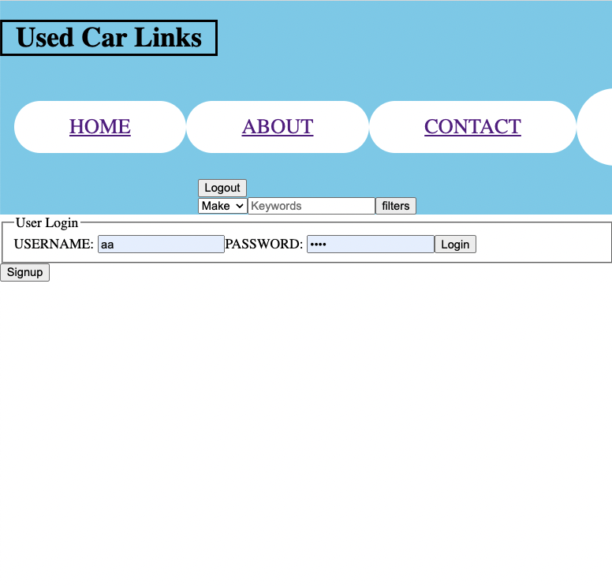
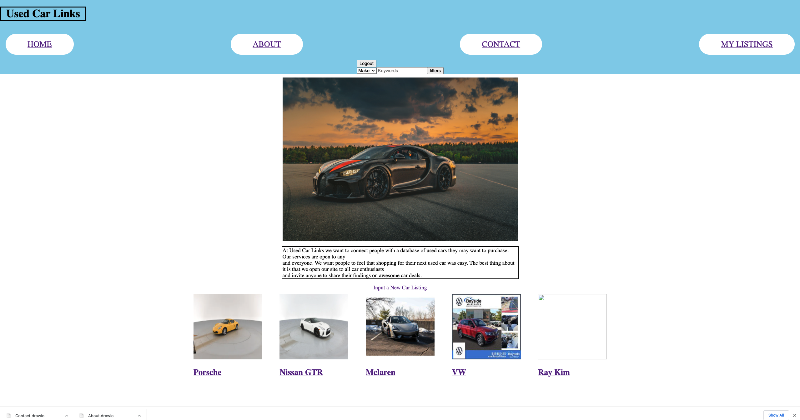
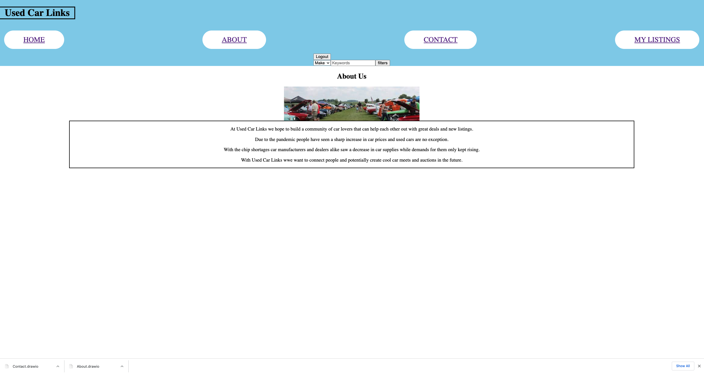
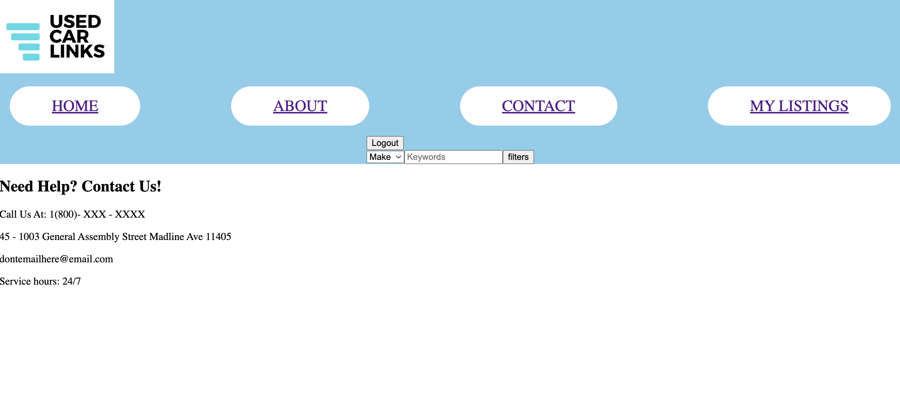
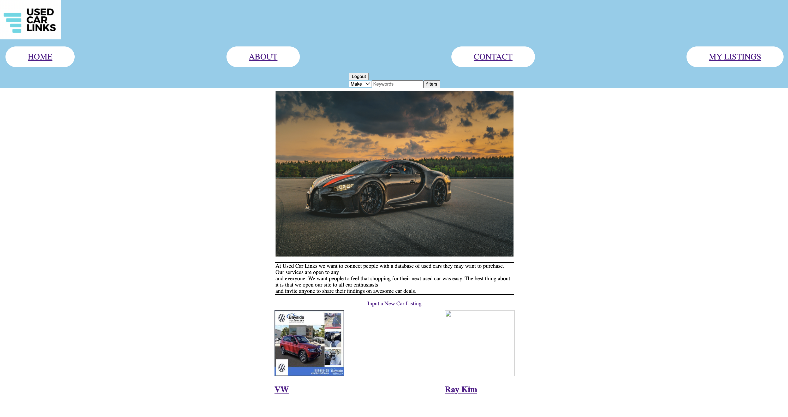

<h1>Technologies used:<h1>
  
<li>Javascript</li>
<li>Css</li>
<li>Express</li>
<li>Bcrypt</li>
<li>Mongoose</li>
<li>Node</li>
<li>MongoDB</li>

The site I decide to create was based on used car websites and sort of a facebook marketplace. The objective of this site is to connect car enthusiasts all around the world with used car listings and meetups for users. As we all know due to the chip shortages finding the right car ove the past months have been quite difficult and although there are sites with similar functions this site will be targeting people more knowledgable with cars and linknig them to people who may not know so much about what a good deal may be. There may be people trying to upload their own listings and pass off an absurd deal for a "great deal", but that is why in the future I want to implement a comment section so that these listings can be critiqued and checked by others. 

When trying to first get onto the site people

Users who already have an account can log in and anyone that would like to sign up can do so as well.

Once logged in users will be brought to the home page

Here users can see the global list of used cars that are on display and navigate through the website

When a user navigates into about

Users will get a summary of the websites objectives and goals. 

Need Help?

If users have any questions or need help with anything they can find our contact info here

Listings

My Trello board:
https://trello.com/b/e0fcZh8C/project-2

heroku link:
https://used-car-links.herokuapp.com/cars
